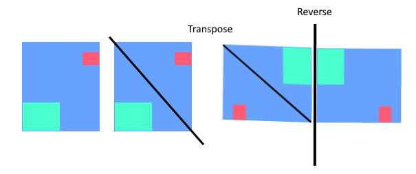

# what is grind ?

- Collection of notes on 150 leetcode problems solutions that i will solve.
- This is also inspired by [bertos](https://github.com/Graffioh/bertos-inferno) repo

# what process i am following ?

- i will be solving neetcode 150 problems (solving each problem by category, using a DFS approach—focusing on one topic at a time.)
- i will be also reading [Everything You Always Wanted To Know About Mathematics* (*But didn’t even know to ask)](https://www.math.cmu.edu/~jmackey/151_128/bws_book.pdf)

# revision tool

- [codellama](https://codellama.dev/problems)

# Resources

- [neetcode](https://www.youtube.com/c/neetcode)

# Problems index

- [48. Rotate Image](#48-rotate-image)

---

## [48. Rotate Image](https://leetcode.com/problems/rotate-image/description/)

### key ideas

- Transpose the matrix by swapping the elements across the main diagonal.
- Reverse each row by swapping the elements from the start and end of the row.
- The time complexity of both solutions is O(n^2), where n is the size of the matrix, as we need to perform the transpose and row reversal operations on the entire matrix. The space complexity is O(1), as we are performing the operations in-place without using any additional memory.
```go
func rotate(matrix [][]int)  {
    // step 1: transpose matrix
    transposeMatrix(matrix)
    //step 2: reverse matrix
    reverseMatrix(matrix) 
}

func transposeMatrix(matrix [][]int){
    n := len(matrix)

    for i:= 0 ; i<n ; i++{
        for j:= i ; j<n; j++{
            matrix[i][j], matrix[j][i] = matrix[j][i],matrix[i][j] 
        }

    }
} 

func reverseMatrix(matrix [][]int){
    n := len(matrix)

    for i:=0; i<n; i++ {
        left,right := 0,n-1
        for left < right {
            matrix[i][left], matrix[i][right] = matrix[i][right], matrix[i][left]
            left++
            right--
        }
    }
}

